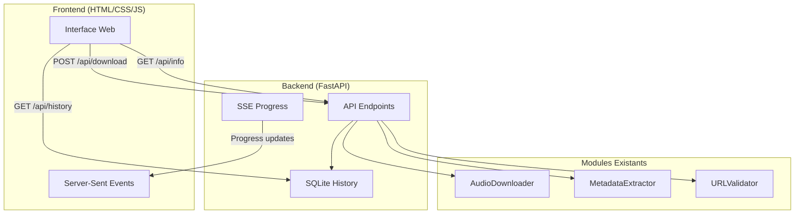

# FastAPI YouTube Downloader UI

## Architecture



## Structure des fichiers à créer

```
src/
├── api/
│   ├── __init__.py
│   ├── app.py              # FastAPI application
│   ├── routes.py           # API endpoints
│   ├── models.py           # Pydantic schemas
│   └── database.py         # SQLite pour historique
├── static/
│   ├── css/
│   │   └── style.css       # Styles modernes
│   └── js/
│       └── app.js          # Logique frontend
└── templates/
    └── index.html          # Page principale
```

## Endpoints API

- `GET /` - Page HTML principale
- `GET /api/info?url=...` - Récupérer métadonnées sans télécharger
- `POST /api/download` - Lancer téléchargement (retourne task_id)
- `GET /api/progress/{task_id}` - SSE pour progression temps réel
- `GET /api/history` - Liste des téléchargements passés
- `GET /api/downloads/{filename}` - Télécharger le fichier audio

## Backend FastAPI

### Fichier principal ([`src/api/app.py`](src/api/app.py))

```python
from fastapi import FastAPI
from fastapi.staticfiles import StaticFiles
from fastapi.templating import Jinja2Templates

app = FastAPI(title="YouTube Audio Downloader")
app.mount("/static", StaticFiles(directory="src/static"))
templates = Jinja2Templates(directory="src/templates")
```

### Modèles Pydantic ([`src/api/models.py`](src/api/models.py))

```python
class DownloadRequest(BaseModel):
    url: str

class VideoInfo(BaseModel):
    title: str
    uploader: str
    duration: str
    thumbnail: str
```

### Progression avec SSE

Utiliser `sse-starlette` pour envoyer les mises à jour de progression en temps réel au frontend via Server-Sent Events.

## Frontend

### Page HTML avec sections

- Input URL + bouton "Analyser"
- Affichage métadonnées (thumbnail, titre, durée)
- Bouton "Télécharger" + barre de progression
- Tableau historique des téléchargements

### Style CSS moderne

- Design responsive
- Animations de progression
- Thème sombre/clair

## Dépendances à ajouter

```
fastapi>=0.109.0
uvicorn>=0.27.0
jinja2>=3.1.0
sse-starlette>=1.8.0
aiosqlite>=0.19.0
python-multipart>=0.0.6
```

## Points d'intégration avec le code existant

Réutiliser directement :

- `AudioDownloader.download_audio()` depuis [`src/audio_downloader.py`](src/audio_downloader.py)
- `MetadataExtractor.extract_metadata()` depuis [`src/metadata_extractor.py`](src/metadata_extractor.py)
- `URLValidator.is_valid_youtube_url()` depuis [`src/audio_downloader.py`](src/audio_downloader.py)
- `Config` depuis [`src/config.py`](src/config.py)